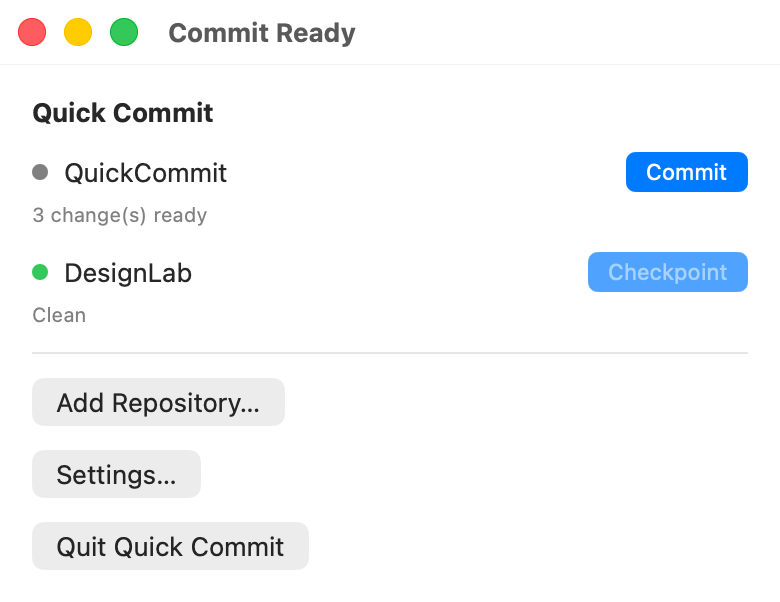

# Quick Commit

Quick Commit is a free, open-source macOS menu-bar app that turns local Git changes into a concise commit with one click.

It is built for solo developers who use Git mainly as personal version control and want a quick checkpoint without writing a commit message by hand. Quick Commit is deliberately simple: click **Commit**, let Apple Intelligence create the message when available, and the commit is created automatically. There are no message-editing controls or team-oriented commit workflow features.

## Screenshots

The menu-bar workflow stays focused: inspect the repository, review the change count, and create a local commit. This image is rendered from the project’s Xcode preview with representative sample data.

<p align="center">
  
</p>

## Download and install

1. Download the latest macOS build from the [GitHub Releases page](../../releases/latest).
2. Unzip it and move `Quick Commit.app` to `/Applications` or another folder you control.
3. Launch the app. It appears in the macOS menu bar.
4. Choose **Add Repository…** and select an existing Git repository.
5. When the repository has changes, click **Commit**. Quick Commit generates the subject and creates the commit automatically.

Only add repositories you trust. Quick Commit asks macOS for access to the folder you select so it can continue monitoring that repository.

## Privacy and automatic commit messages

- Apple Intelligence is optional and runs through Apple’s on-device Foundation Models APIs.
- The model is used only to create a concise commit subject from bounded change context.
- There is no external AI service, network AI API, or Git command-line process.
- If Apple Intelligence is unavailable or produces an unsuitable result, Quick Commit uses a deterministic local fallback.

Apple Intelligence availability depends on the Mac, operating-system configuration, language, and current Apple platform support. Quick Commit remains usable without it, but the commit message is still generated automatically.

## What Quick Commit does

- Validates and monitors user-selected Git repositories.
- Uses libgit2 in process to inspect, stage, and create a local commit.
- Uses the repository Git identity by default, with an optional app-level identity override.
- Preserves safety around existing index changes and reports recoverable failures.
- Keeps the workflow deliberately small: inspect changes, generate a subject, and commit.

## What it does not do

Quick Commit is intentionally local. It does not push, fetch, merge, rebase, switch branches, reset, clean, or delete repository data. It is not a team commit-review tool, a GitHub client, or an AI chat interface.

## Requirements

- macOS 26 or newer
- An existing Git repository
- Apple Intelligence is optional; the local fallback works without it

## Build from source

Open `QuickCommit.xcodeproj` in Xcode 27 or newer, select the `QuickCommit` scheme, and build it for macOS. From the repository root, run:

```text
./script/build_and_run.sh --verify
```

The project uses direct libgit2 integration and App Sandbox entitlements for user-selected file access. See [development setup](Docs/Development/DevelopmentSetup.md), [privacy and AI architecture](Docs/Architecture/PrivacyAndAI.md), and the [GitHub release guide](Docs/Development/GitHubRelease.md) for technical details.

## Contributing

Bug reports, documentation improvements, test fixtures, and focused pull requests are welcome. Please read [CONTRIBUTING.md](CONTRIBUTING.md) before making changes.

## License

Quick Commit is released under the [MIT License](LICENSE). You may use, modify, distribute, and sell copies of the source software, provided the copyright and license notice are retained. The MIT License does not grant permission to use the Quick Commit name, logo, icons, or other branding to imply that a fork is the official project.

Copyright © 2026 Brave New Design LLC.

## Project status

Quick Commit is under active development. GitHub is the first distribution channel; a Mac App Store release is planned separately and remains **TBD**.
